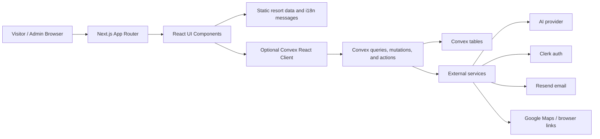

# 360 Tour Application Diagram

## Architecture

The site is a multilingual villa booking and 360-tour experience. Public pages can run in demo mode from bundled data, and live mode is enabled when Convex and related environment variables are configured.

## Route Map

| Route | Audience | Purpose | Primary modules |
| --- | --- | --- | --- |
| `/` and `/[locale]` | Public visitors | Landing page with hero, quick booking, villas, amenities, reviews, location, and contact CTA. | `HomeHero`, `HomeQuickBooking`, `VillaCard`, `ReviewCarousel` |
| `/rooms/[id]` and `/[locale]/rooms/[id]` | Public visitors | Room detail and 360 tour entry point for a selected villa or room. | `RoomDetailClient`, `TourViewer`, `TourCanvas`, `RoomSphere`, `Hotspot` |
| `/booking` and `/[locale]/booking` | Booking guests | Step-by-step villa, date, guest, details, and review flow. | `BookingFunnel`, `VillaSelector`, `BookingDatePicker`, `BookingPanels` |
| `/booking/pay` and `/[locale]/booking/pay` | Booking guests | Demo payment confirmation or guarded live-payment state. | `PayClient` |
| `/booking/success` and `/[locale]/booking/success` | Booking guests | Booking result page for confirmed demo/live bookings or unavailable live verification. | `BookingSuccessClient` |
| `/chat` and `/[locale]/chat` | Public visitors | Full-page concierge chat experience. | `AIChatWidget`, `ChatContext`, `MessagingButtons` |
| `/sign-in` and `/sign-up` | Admin users | Clerk authentication entry points when Clerk is configured. | Clerk pages, `isClerkConfigured` |
| `/admin` | Admin users | Chat dashboard or setup guidance when Clerk/Convex auth is incomplete. | `AdminChatDashboard`, Convex admin chat functions |
| `/admin/chat` | Legacy admin users | Redirects to `/admin`. | Next redirect route |

## Feature And Data Flow

| Feature | User flow | Data source | Live backend behavior | Demo/fallback behavior |
| --- | --- | --- | --- | --- |
| Villa browsing | Visitor scans home page cards and room pages. | Localized property, resort, story, pricing, and review data. | Can supplement inventory from Convex property queries. | Static public data renders without Convex. |
| 360 tour | Visitor opens room/tour UI, pans through scenes, taps hotspots, and may submit a lead. | Tour room metadata and static assets. | Lead capture can save to Convex when configured. | Tour remains browsable and lead capture degrades safely. |
| Booking | Guest selects villa, dates, guests, details, then reviews the reservation. | Booking state, quote utilities, local inventory cache, Convex availability when available. | Queries availability, quotes stays, and creates booking records in Convex. | Uses demo villa inventory and routes to demo payment. |
| Chat concierge | Visitor opens overlay or chat page, asks questions, receives suggestions, and can continue in external browsers. | Local chat state, cached transcript, ranked/static suggestions. | Creates sessions, stores messages, calls AI action, ranks suggestions, tracks handoffs. | Uses local/static answers and contact links if Convex or AI is unavailable. |
| Admin chat dashboard | Admin signs in and reviews live chat sessions, transcripts, and suggested questions. | Clerk auth state and Convex chat/admin queries. | Requires Clerk, Convex auth config, and allowed admin emails. | Shows setup state explaining missing configuration. |
| Internationalization | Visitor switches locale or enters localized route. | `next-intl` routing, localized messages, and localized public content helpers. | Same backend functions serve locale-aware UI requests. | Localized static content remains available. |
| Demo disclaimer | Public visitor sees one-time demo disclosure per browser session. | Browser session storage. | Independent of backend. | Fully client-side. |

## Runtime And Environment Categories

| Category | Used by | Notes |
| --- | --- | --- |
| Convex public URL | Next.js client provider, booking, chat, admin dashboard | Enables live backend mode. Placeholder or missing values keep the app in safe fallback/demo states. |
| Convex server environment | Convex functions and actions | Stores AI, email, admin allowlist, and auth issuer configuration. |
| Clerk public and secret keys | Auth pages, admin area, Convex auth bridge | Required for authenticated admin workflows. Public pages can run without Clerk. |
| AI provider configuration | Convex chat AI and ranked suggestions | Enables live AI concierge responses and suggestion ranking. |
| Resend/email configuration | Convex email actions | Enables booking/contact notification email delivery. |
| App runtime | Next.js, React, Three.js, Playwright, Vitest | Project is pinned to `pnpm@10.30.3` and expects Node 22.x. |

## Verification Checklist

| Check | Expected result |
| --- | --- |
| `pnpm check` | TypeScript completes without type errors. |
| `pnpm lint` | ESLint completes without lint errors. |
| `pnpm test:unit` | Vitest unit tests pass. |
| `pnpm test:e2e` | Playwright validates public, booking, chat, localized, and admin flows. |
| Browser smoke test | Home, localized home, room/tour, booking, chat, and admin setup pages load without console-breaking errors. |
| Secret handling | `.env.local` exists locally but no secret values are copied into this document or command output. |
